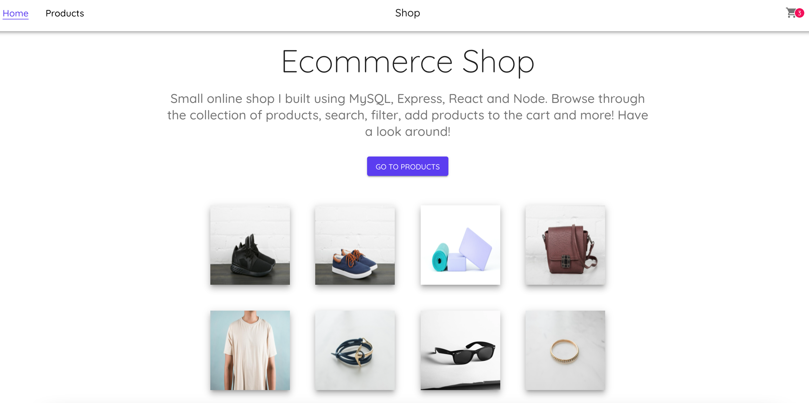

# e-commerce-app

- Small online shop I built using MySQL, Express, React and Node. Browse through the collection of products, search, filter, add products to the cart and more! 

# What I used to build the project

* React.js
* Material UI (https://material-ui.com/)
* HTML
* Axios

